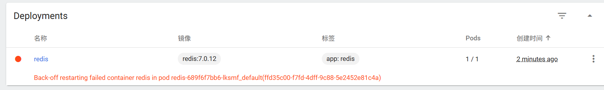

在 Kubernetes 中，Pod 的 IP 是临时的，重启后一定会变。为了解决这个问题，我们**必须**使用 Service。

针对你的要求，这里有一个核心概念需要理清：

1. **集群内部访问（IP不变）**：使用 `ClusterIP` 类型的 Service（默认类型）。它会分配一个固定的虚拟 IP（VIP），无论 Redis Pod 重启多少次、IP 怎么变，这个 VIP 永远不变。
2. **集群外部访问**：使用 `NodePort` 类型的 Service。它会在每个节点上开放一个端口，通过 `节点IP:端口` 的方式从外部连接。

**好消息是：一个 Service 可以同时是 ClusterIP 和 NodePort。** 当你定义 `type: NodePort` 时，K8s 会自动给它分配一个内部固定的 ClusterIP，同时也通过 NodePort 暴露给外部。

下面是整合了 **Deployment**（无状态部署）+ **NodePort Service**（固定入口）的完整方案。

### 📝 部署配置文件

创建一个名为 `redis-deploy.yaml` 的文件。

这个配置做了三件事：

1. **ConfigMap**：管理 Redis 配置（开启密码、持久化）。
2. **Deployment**：运行 Redis 容器，挂载配置和数据。
3. **Service (NodePort)**：**关键点**。它既提供了内部固定的 IP，又提供了外部的访问端口。

```yaml
# 1. ConfigMap：Redis 配置文件
apiVersion: v1
kind: ConfigMap
metadata:
  name: redis-config
data:
  redis.conf: |
    bind 0.0.0.0
    port 6379
    requirepass asd1234567-  
    appendonly yes                    # 开启 AOF 持久化
    dir /data
    protected-mode no                 # 允许外部访问
---
# 2. Deployment：部署 Redis
apiVersion: apps/v1
kind: Deployment
metadata:
  name: redis
  labels:
    app: redis
spec:
  replicas: 1
  selector:
    matchLabels:
      app: redis
  template:
    metadata:
      labels:
        app: redis
    spec:
      containers:
      - name: redis
        image: redis:7.0.12
        command: ["redis-server", "/etc/redis/redis.conf"]
        ports:
        - containerPort: 6379
        volumeMounts:
        - name: config
          mountPath: /etc/redis
        - name: data
          mountPath: /data
        # 健康检查
        livenessProbe:
          tcpSocket:
            port: 6379
          initialDelaySeconds: 30
          periodSeconds: 10
      volumes:
      - name: config
        configMap:
          name: redis-config
      # 注意：这里为了演示简单使用了 emptyDir。
      # 如果需要数据在节点重启后也不丢失，请替换为 persistentVolumeClaim。
      - name: data
        emptyDir: {} 
---
# 3. Service：NodePort 类型
# 它会自动拥有一个内部固定的 ClusterIP，同时通过 NodePort 暴露给外部
apiVersion: v1
kind: Service
metadata:
  name: redis-service
  labels:         
    app: redis 
spec:
  type: NodePort  # 核心配置
  selector:
    app: redis
  ports:
  - port: 6379        # 集群内部访问端口
    targetPort: 6379  # 容器端口
    nodePort: 30379   # 外部访问端口 (范围 30000-32767)
```

### 🚀 部署与验证

1. **应用配置**：

   ```bash
   kubectl apply -f redis-deploy.yaml
   ```

2. **查看 Service 详情**：
   运行以下命令，你会看到 `CLUSTER-IP` 和 `PORT(S)` 两列关键信息。

   ```bash
   kubectl get svc redis-service
   ```

   **输出示例：**

   ```text
   NAME            TYPE       CLUSTER-IP      EXTERNAL-IP   PORT(S)           AGE
   redis-service   NodePort   10.96.123.45    <none>        6379:31000/TCP   10s
   ```

   - **10.96.123.45**：这是内部固定 IP。无论 Pod 怎么重启，这个 IP 永远不会变。集群内的其他应用连这个 IP 即可。
   - **31000**：这是外部端口。

### 如何访问

#### 1. 集群外部访问（你的主要需求）

通过任意一个 K8s 节点的 IP 地址加上 `31000` 端口访问。

```bash
# 将 <NODE_IP> 替换为任意节点的 IP
redis-cli -h <NODE_IP> -p 31000 -a your_secure_password ping
```

#### 2. 集群内部访问（IP 不变的需求）

如果你在集群里有其他 Pod 需要连 Redis，不要连 Pod IP，而是连 Service 的 ClusterIP（或者直接连 Service 的名字 `redis-service`）。

```bash
# 在集群内其他 Pod 执行
redis-cli -h redis-service -p 6379 -a your_secure_password ping
```

### 💡 总结

你不需要纠结 Pod IP 会变，**Service 就是为了解决这个问题而生的**。使用 `NodePort` 类型的 Service，你既得到了一个内部稳定的入口（ClusterIP），也得到了一个外部访问的通道（NodePort），一举两得。


出现

我们可以看详细的上一个容器退出时的日志：
```bash
kubectl logs redis-689f6f7bb6-lksmf --previous
```

