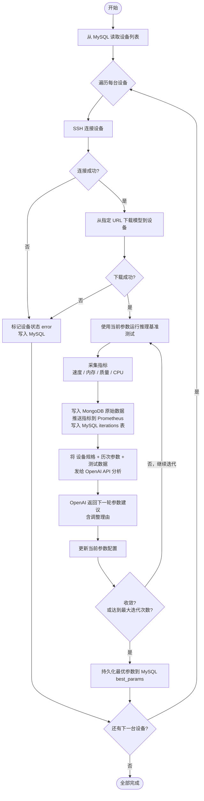

# 边缘设备模型参数自动调优系统设计

## 一、系统架构

```
云端调度中心（Orchestrator）
├── 设备表（MySQL: devices）         ← 存所有边缘设备 IP
├── 迭代控制器（IterationController） ← 控制循环、收敛判断
├── SSH 执行器（SSHExecutor）         ← 连接设备、下载模型、执行测试
├── 参数分析器（OpenAI API）          ← 分析数据、给出下一轮参数建议
└── 存储层
    ├── MySQL      — 设备信息、迭代历史、最优参数
    ├── MongoDB    — 每次测试的原始数据、模型输出
    └── Prometheus — 实时指标推送（tokens/s、内存、CPU）
```

---

## 二、完整流程图（Mermaid）



---

## 三、项目结构

```
auto_tuner/
├── main.py                     # 入口：遍历设备，启动调优循环
├── config.yaml                 # 全局配置
├── orchestrator/
│   ├── __init__.py
│   ├── ssh_executor.py         # SSH 连接、上传脚本、执行命令
│   ├── iteration_ctrl.py       # 迭代控制、收敛判断
│   └── param_analyzer.py       # 调用 OpenAI API 分析参数
├── benchmark/
│   └── agent.py                # 在边缘设备上运行的基准测试脚本
├── storage/
│   ├── __init__.py
│   ├── mysql_client.py         # 设备表、迭代表、最优参数读写
│   ├── mongo_client.py         # 原始测试数据存储
│   └── prometheus_client.py    # 指标推送到 Pushgateway
└── requirements.txt
```

---

## 四、数据库 Schema

### MySQL

```sql
-- 边缘设备表
CREATE TABLE devices (
    id            INT PRIMARY KEY AUTO_INCREMENT,
    name          VARCHAR(64)   NOT NULL,
    ip            VARCHAR(64)   NOT NULL UNIQUE,
    ssh_user      VARCHAR(64)   NOT NULL,
    ssh_key_path  VARCHAR(256)  NOT NULL,
    model_url     VARCHAR(512)  NOT NULL,
    status        ENUM('idle','running','done','error') DEFAULT 'idle',
    created_at    DATETIME DEFAULT NOW()
);

-- 每次迭代的指标记录
CREATE TABLE iterations (
    id                INT PRIMARY KEY AUTO_INCREMENT,
    device_id         INT NOT NULL,
    iteration         INT NOT NULL,
    params            JSON,
    ttft_ms           FLOAT,
    tokens_per_second FLOAT,
    ram_peak_mb       FLOAT,
    bleu_score        FLOAT,
    cpu_avg_percent   FLOAT,
    converged         BOOLEAN DEFAULT FALSE,
    created_at        DATETIME DEFAULT NOW(),
    FOREIGN KEY (device_id) REFERENCES devices(id)
);

-- 每台设备的最优参数
CREATE TABLE best_params (
    id          INT PRIMARY KEY AUTO_INCREMENT,
    device_id   INT NOT NULL UNIQUE,
    params      JSON,
    score       FLOAT,
    updated_at  DATETIME DEFAULT NOW() ON UPDATE NOW(),
    FOREIGN KEY (device_id) REFERENCES devices(id)
);
```

### MongoDB（collection: `benchmark_raw`）

```json
{
  "device_id": 1,
  "device_ip": "192.168.1.10",
  "iteration": 3,
  "params": {
    "quantization": "int4",
    "max_new_tokens": 128,
    "do_sample": false,
    "temperature": 0.7,
    "top_p": 0.8,
    "num_beams": 1
  },
  "outputs": [
    {
      "prompt": "请介绍一下大语言模型。",
      "response": "大语言模型是...",
      "bleu": 0.72,
      "rouge_l": 0.68,
      "ttft_ms": 320,
      "total_time_ms": 2100
    }
  ],
  "system_info": {
    "ram_total_mb": 4096,
    "cpu_model": "ARM Cortex-A55",
    "os": "Ubuntu 22.04"
  },
  "openai_reasoning": "当前 tokens/s 较低，建议降低 max_new_tokens 至 64",
  "timestamp": "2026-04-07T10:00:00Z"
}
```

### Prometheus（Pushgateway 指标）

```
edge_model_tokens_per_second{device="192.168.1.10", iteration="3"} 12.4
edge_model_ram_peak_mb{device="192.168.1.10",       iteration="3"} 1820
edge_model_ttft_ms{device="192.168.1.10",           iteration="3"} 310
edge_model_bleu_score{device="192.168.1.10",        iteration="3"} 0.72
edge_model_cpu_avg{device="192.168.1.10",           iteration="3"} 78.5
```

---

## 五、各模块代码

### config.yaml

```yaml
max_iterations: 10
convergence_window: 3       # 连续几次不变视为收敛
convergence_threshold: 0.05 # 变化幅度 < 5% 视为收敛

initial_params:
  quantization: "int4"
  max_new_tokens: 128
  do_sample: false
  temperature: 0.7
  top_p: 0.8
  num_beams: 1

openai:
  api_key: "${OPENAI_API_KEY}"
  model: "gpt-4o"

mysql:
  host: "localhost"
  port: 3306
  user: "root"
  password: "${MYSQL_PASSWORD}"
  database: "edge_tuner"

mongodb:
  uri: "mongodb://localhost:27017"
  database: "edge_tuner"

prometheus:
  pushgateway_url: "http://localhost:9091"
```

---

### main.py

```python
import yaml
from storage.mysql_client import MySQLClient
from orchestrator.ssh_executor import SSHExecutor
from orchestrator.iteration_ctrl import IterationController

def main():
    with open("config.yaml") as f:
        cfg = yaml.safe_load(f)

    db = MySQLClient(cfg["mysql"])
    devices = db.get_all_devices()

    for device in devices:
        print(f"\n=== 开始调优设备: {device['ip']} ===")
        db.update_device_status(device["id"], "running")
        try:
            ctrl = IterationController(device, cfg)
            ctrl.run()
            db.update_device_status(device["id"], "done")
        except Exception as e:
            print(f"设备 {device['ip']} 出错: {e}")
            db.update_device_status(device["id"], "error")

if __name__ == "__main__":
    main()
```

---

### orchestrator/ssh_executor.py

```python
import paramiko
import json

class SSHExecutor:
    def __init__(self, ip, user, key_path):
        self.ip = ip
        self.client = paramiko.SSHClient()
        self.client.set_missing_host_key_policy(paramiko.AutoAddPolicy())
        self.client.connect(ip, username=user, key_filename=key_path, timeout=30)

    def run(self, cmd: str) -> tuple[str, str]:
        """执行命令，返回 (stdout, stderr)"""
        _, stdout, stderr = self.client.exec_command(cmd, timeout=600)
        return stdout.read().decode(), stderr.read().decode()

    def download_model(self, url: str, target_dir: str = "~/model"):
        """从 URL 下载模型到边缘设备"""
        self.run(f"mkdir -p {target_dir}")
        out, err = self.run(
            f"wget -q --show-progress -P {target_dir} {url} 2>&1"
        )
        if err and "ERROR" in err:
            raise RuntimeError(f"模型下载失败: {err}")
        print(f"  模型下载完成: {url}")

    def upload_benchmark_script(self):
        """将 benchmark/agent.py 上传到边缘设备"""
        sftp = self.client.open_sftp()
        sftp.put("benchmark/agent.py", "/tmp/benchmark_agent.py")
        sftp.close()

    def run_benchmark(self, params: dict, model_dir: str = "~/model") -> dict:
        """在边缘设备上运行基准测试，返回结果 dict"""
        params_json = json.dumps(params).replace('"', '\\"')
        cmd = (
            f'python3 /tmp/benchmark_agent.py '
            f'--model_dir {model_dir} '
            f'--params "{params_json}"'
        )
        out, err = self.run(cmd)
        if err and "Traceback" in err:
            raise RuntimeError(f"基准测试失败: {err}")
        return json.loads(out)

    def close(self):
        self.client.close()
```

---

### orchestrator/iteration_ctrl.py

```python
from orchestrator.ssh_executor import SSHExecutor
from orchestrator.param_analyzer import ParamAnalyzer
from storage.mysql_client import MySQLClient
from storage.mongo_client import MongoClient
from storage.prometheus_client import PrometheusClient

class IterationController:
    def __init__(self, device: dict, cfg: dict):
        self.device = device
        self.cfg = cfg
        self.params = dict(cfg["initial_params"])
        self.history = []

        self.ssh = SSHExecutor(device["ip"], device["ssh_user"], device["ssh_key_path"])
        self.analyzer = ParamAnalyzer(cfg["openai"])
        self.mysql = MySQLClient(cfg["mysql"])
        self.mongo = MongoClient(cfg["mongodb"])
        self.prom = PrometheusClient(cfg["prometheus"])

    def run(self):
        # 1. 下载模型（只下载一次）
        self.ssh.download_model(self.device["model_url"])
        self.ssh.upload_benchmark_script()

        max_iter = self.cfg["max_iterations"]

        for i in range(1, max_iter + 1):
            print(f"  迭代 {i}/{max_iter}，当前参数: {self.params}")

            # 2. 运行基准测试
            result = self.ssh.run_benchmark(self.params)
            result["iteration"] = i
            result["params"] = dict(self.params)
            self.history.append(result)

            # 3. 写入存储
            self.mysql.save_iteration(self.device["id"], i, self.params, result)
            self.mongo.save_raw(self.device["id"], self.device["ip"], i, self.params, result)
            self.prom.push(self.device["ip"], i, result)

            # 4. 判断收敛
            if self._is_converged():
                print(f"  第 {i} 次迭代后收敛")
                self.mysql.save_iteration(self.device["id"], i, self.params, result, converged=True)
                break

            # 5. 调用 OpenAI 获取下一轮参数
            self.params = self.analyzer.suggest(
                device_info=self.device,
                history=self.history,
            )
            print(f"  OpenAI 建议新参数: {self.params}")

        # 6. 持久化最优参数
        best = max(self.history, key=lambda r: r.get("tokens_per_second", 0))
        self.mysql.save_best_params(self.device["id"], best["params"], best["tokens_per_second"])
        print(f"  最优参数已保存: {best['params']}")
        self.ssh.close()

    def _is_converged(self) -> bool:
        window = self.cfg["convergence_window"]
        threshold = self.cfg["convergence_threshold"]
        if len(self.history) < window:
            return False
        recent = self.history[-window:]
        for key in ["tokens_per_second", "ram_peak_mb", "bleu_score"]:
            vals = [r.get(key, 0) for r in recent]
            if max(vals) == 0:
                continue
            delta = (max(vals) - min(vals)) / max(vals)
            if delta > threshold:
                return False
        return True
```

---

### orchestrator/param_analyzer.py

```python
import json
from openai import OpenAI

SYSTEM_PROMPT = """
你是边缘计算模型部署专家。根据设备规格和历次测试数据，给出下一轮参数调整建议。
只返回 JSON，格式如下，不要有任何多余文字：
{
  "quantization": "int4 或 int8 或 fp16",
  "max_new_tokens": <整数>,
  "do_sample": <true 或 false>,
  "temperature": <0.0~1.0>,
  "top_p": <0.0~1.0>,
  "num_beams": <整数，边缘设备建议为1>,
  "reasoning": "<本次调整的理由>"
}
"""

class ParamAnalyzer:
    def __init__(self, cfg: dict):
        self.client = OpenAI(api_key=cfg["api_key"])
        self.model = cfg["model"]

    def suggest(self, device_info: dict, history: list[dict]) -> dict:
        user_msg = f"""
设备信息：
- IP: {device_info['ip']}

历次测试数据（最近 {len(history)} 次）：
{json.dumps(history, ensure_ascii=False, indent=2)}

请根据以上数据，给出下一轮参数调整建议。
"""
        response = self.client.chat.completions.create(
            model=self.model,
            messages=[
                {"role": "system", "content": SYSTEM_PROMPT},
                {"role": "user",   "content": user_msg},
            ],
            response_format={"type": "json_object"},
            temperature=0.2,
        )
        result = json.loads(response.choices[0].message.content)
        result.pop("reasoning", None)  # reasoning 只用于记录，不传给模型
        return result
```

---

### storage/mysql_client.py

```python
import pymysql
import json
from datetime import datetime

class MySQLClient:
    def __init__(self, cfg: dict):
        self.conn = pymysql.connect(
            host=cfg["host"], port=cfg["port"],
            user=cfg["user"], password=cfg["password"],
            database=cfg["database"], charset="utf8mb4",
            autocommit=True,
        )

    def get_all_devices(self) -> list[dict]:
        with self.conn.cursor(pymysql.cursors.DictCursor) as cur:
            cur.execute("SELECT * FROM devices WHERE status != 'error'")
            return cur.fetchall()

    def update_device_status(self, device_id: int, status: str):
        with self.conn.cursor() as cur:
            cur.execute("UPDATE devices SET status=%s WHERE id=%s", (status, device_id))

    def save_iteration(self, device_id, iteration, params, result, converged=False):
        with self.conn.cursor() as cur:
            cur.execute("""
                INSERT INTO iterations
                  (device_id, iteration, params, ttft_ms, tokens_per_second,
                   ram_peak_mb, bleu_score, cpu_avg_percent, converged)
                VALUES (%s,%s,%s,%s,%s,%s,%s,%s,%s)
            """, (
                device_id, iteration, json.dumps(params),
                result.get("ttft_ms"), result.get("tokens_per_second"),
                result.get("ram_peak_mb"), result.get("bleu_score"),
                result.get("cpu_avg_percent"), converged,
            ))

    def save_best_params(self, device_id: int, params: dict, score: float):
        with self.conn.cursor() as cur:
            cur.execute("""
                INSERT INTO best_params (device_id, params, score)
                VALUES (%s, %s, %s)
                ON DUPLICATE KEY UPDATE params=%s, score=%s, updated_at=NOW()
            """, (device_id, json.dumps(params), score, json.dumps(params), score))
```

---

### storage/mongo_client.py

```python
from pymongo import MongoClient as PyMongoClient
from datetime import datetime, timezone

class MongoClient:
    def __init__(self, cfg: dict):
        self.db = PyMongoClient(cfg["uri"])[cfg["database"]]
        self.col = self.db["benchmark_raw"]

    def save_raw(self, device_id, device_ip, iteration, params, result):
        doc = {
            "device_id":  device_id,
            "device_ip":  device_ip,
            "iteration":  iteration,
            "params":     params,
            "outputs":    result.get("outputs", []),
            "system_info": result.get("system_info", {}),
            "ttft_ms":    result.get("ttft_ms"),
            "tokens_per_second": result.get("tokens_per_second"),
            "ram_peak_mb": result.get("ram_peak_mb"),
            "bleu_score": result.get("bleu_score"),
            "timestamp":  datetime.now(timezone.utc),
        }
        self.col.insert_one(doc)
```

---

### storage/prometheus_client.py

```python
from prometheus_client import CollectorRegistry, Gauge, push_to_gateway

class PrometheusClient:
    def __init__(self, cfg: dict):
        self.gateway = cfg["pushgateway_url"]

    def push(self, device_ip: str, iteration: int, result: dict):
        registry = CollectorRegistry()
        labels = {"device": device_ip, "iteration": str(iteration)}

        metrics = {
            "edge_model_tokens_per_second": result.get("tokens_per_second", 0),
            "edge_model_ram_peak_mb":       result.get("ram_peak_mb", 0),
            "edge_model_ttft_ms":           result.get("ttft_ms", 0),
            "edge_model_bleu_score":        result.get("bleu_score", 0),
            "edge_model_cpu_avg":           result.get("cpu_avg_percent", 0),
        }

        for name, value in metrics.items():
            g = Gauge(name, name, labelnames=list(labels.keys()), registry=registry)
            g.labels(**labels).set(value)

        push_to_gateway(
            self.gateway,
            job=f"edge_tuner_{device_ip.replace('.', '_')}",
            registry=registry,
        )
```

---

### benchmark/agent.py（运行在边缘设备上）

```python
#!/usr/bin/env python3
"""
此脚本由云端通过 SSH 上传并执行，运行在边缘设备上。
"""
import argparse
import json
import time
import threading
import psutil
import torch
from transformers import AutoModelForCausalLM, AutoTokenizer, BitsAndBytesConfig

TEST_PROMPTS = [
    {"input": "请用一句话介绍人工智能。", "reference": "人工智能是模拟人类智能的技术。"},
    {"input": "1加1等于多少？",           "reference": "2"},
    {"input": "天空为什么是蓝色的？",     "reference": "因为大气散射蓝色波长的光。"},
]

def load_model(model_dir, quantization):
    if quantization == "int4":
        cfg = BitsAndBytesConfig(
            load_in_4bit=True,
            bnb_4bit_compute_dtype=torch.float16,
            bnb_4bit_use_double_quant=True,
            bnb_4bit_quant_type="nf4",
        )
        return AutoModelForCausalLM.from_pretrained(
            model_dir, quantization_config=cfg, device_map="auto", low_cpu_mem_usage=True
        )
    elif quantization == "int8":
        return AutoModelForCausalLM.from_pretrained(
            model_dir, load_in_8bit=True, device_map="auto", low_cpu_mem_usage=True
        )
    else:
        return AutoModelForCausalLM.from_pretrained(
            model_dir, torch_dtype=torch.float16, device_map="auto", low_cpu_mem_usage=True
        )

def collect_system_info():
    mem = psutil.virtual_memory()
    cpu_freq = psutil.cpu_freq()
    return {
        "ram_total_mb": round(mem.total / 1024 / 1024),
        "cpu_count": psutil.cpu_count(),
        "cpu_freq_mhz": round(cpu_freq.current) if cpu_freq else 0,
    }

def run_single(model, tokenizer, prompt_item, params):
    from nltk.translate.bleu_score import sentence_bleu, SmoothingFunction

    inputs = tokenizer(prompt_item["input"], return_tensors="pt").to(model.device)
    cpu_samples = []
    stop_flag = {"stop": False}

    def monitor():
        while not stop_flag["stop"]:
            cpu_samples.append(psutil.cpu_percent(interval=0.1))

    t = threading.Thread(target=monitor, daemon=True)
    t.start()

    ram_before = psutil.virtual_memory().used / 1024 / 1024
    start = time.perf_counter()

    with torch.no_grad():
        output_ids = model.generate(
            **inputs,
            max_new_tokens=params.get("max_new_tokens", 128),
            do_sample=params.get("do_sample", False),
            temperature=params.get("temperature", 0.7),
            top_p=params.get("top_p", 0.8),
            num_beams=params.get("num_beams", 1),
            use_cache=True,
        )

    end = time.perf_counter()
    stop_flag["stop"] = True
    t.join()

    ram_peak = psutil.virtual_memory().used / 1024 / 1024
    output_tokens = output_ids.shape[1] - inputs["input_ids"].shape[1]
    total_ms = (end - start) * 1000
    response = tokenizer.decode(output_ids[0][inputs["input_ids"].shape[1]:], skip_special_tokens=True)

    # BLEU
    ref = prompt_item.get("reference", "")
    bleu = sentence_bleu(
        [ref.split()], response.split(),
        smoothing_function=SmoothingFunction().method1
    ) if ref else 0.0

    return {
        "prompt": prompt_item["input"],
        "response": response,
        "ttft_ms": round(total_ms * 0.3),   # 估算首token延迟
        "total_time_ms": round(total_ms),
        "tokens_per_second": round(output_tokens / (end - start), 2),
        "ram_peak_mb": round(ram_peak),
        "cpu_avg_percent": round(sum(cpu_samples) / len(cpu_samples)) if cpu_samples else 0,
        "bleu": round(bleu, 4),
    }

def main():
    import nltk
    nltk.download("punkt", quiet=True)

    parser = argparse.ArgumentParser()
    parser.add_argument("--model_dir", required=True)
    parser.add_argument("--params", required=True)
    args = parser.parse_args()

    params = json.loads(args.params)
    tokenizer = AutoTokenizer.from_pretrained(args.model_dir)
    model = load_model(args.model_dir, params.get("quantization", "int4"))

    outputs = [run_single(model, tokenizer, p, params) for p in TEST_PROMPTS]

    # 汇总指标
    summary = {
        "ttft_ms":           sum(o["ttft_ms"] for o in outputs) / len(outputs),
        "tokens_per_second": sum(o["tokens_per_second"] for o in outputs) / len(outputs),
        "ram_peak_mb":       max(o["ram_peak_mb"] for o in outputs),
        "bleu_score":        sum(o["bleu"] for o in outputs) / len(outputs),
        "cpu_avg_percent":   sum(o["cpu_avg_percent"] for o in outputs) / len(outputs),
        "outputs":           outputs,
        "system_info":       collect_system_info(),
    }
    print(json.dumps(summary, ensure_ascii=False))

if __name__ == "__main__":
    main()
```

---

### requirements.txt

```
# 云端调度中心
paramiko
pymysql
pymongo
prometheus-client
openai
pyyaml
# 边缘设备（在边缘设备上单独安装）
transformers>=4.37.0
torch
peft
bitsandbytes
accelerate
psutil
nltk
```

---

## 六、快速启动

```bash
# 1. 安装依赖
pip install -r requirements.txt

# 2. 配置环境变量
export OPENAI_API_KEY="sk-..."
export MYSQL_PASSWORD="your_password"

# 3. 初始化 MySQL 表结构
mysql -u root -p edge_tuner < schema.sql

# 4. 在 MySQL devices 表中添加边缘设备
INSERT INTO devices (name, ip, ssh_user, ssh_key_path, model_url)
VALUES
  ('edge-01', '192.168.1.10', 'ubuntu', '/root/.ssh/id_rsa', 'https://your-url/model.zip'),
  ('edge-02', '192.168.1.11', 'ubuntu', '/root/.ssh/id_rsa', 'https://your-url/model.zip');

# 5. 启动调优
python main.py
```


关于如何本地部署指标监控相关：https://zhuanlan.zhihu.com/p/1895140171420267942


---
  25天论文时间规划

  第一阶段：系统开发（Day 1~10）

  ┌────────┬───────────────────────────────────────────────────────┐
  │   天   │                         任务                          │
  ├────────┼───────────────────────────────────────────────────────┤
  │ Day 1  │ 环境搭建：MySQL、MongoDB、Prometheus+Grafana 本地部署 │
  ├────────┼───────────────────────────────────────────────────────┤
  │ Day 2  │ SSH 连接模块 + 设备管理（devices 表增删查）           │
  ├────────┼───────────────────────────────────────────────────────┤
  │ Day 3  │ 基准测试 agent 在边缘设备跑通（或用 Docker 模拟）     │
  ├────────┼───────────────────────────────────────────────────────┤
  │ Day 4  │ OpenAI API 参数分析模块                               │
  ├────────┼───────────────────────────────────────────────────────┤
  │ Day 5  │ 迭代控制器 + 收敛判断逻辑                             │
  ├────────┼───────────────────────────────────────────────────────┤
  │ Day 6  │ MySQL / MongoDB / Prometheus 三个存储客户端           │
  ├────────┼───────────────────────────────────────────────────────┤
  │ Day 7  │ 全流程联调，跑通至少 1 台设备的完整迭代               │
  ├────────┼───────────────────────────────────────────────────────┤
  │ Day 8  │ 多设备并发测试，修复 bug                              │
  ├────────┼───────────────────────────────────────────────────────┤
  │ Day 9  │ Grafana 大盘配置，可视化指标                          │
  ├────────┼───────────────────────────────────────────────────────┤
  │ Day 10 │ 整理实验数据、截图、录屏                              │
  └────────┴───────────────────────────────────────────────────────┘

  ---
  第二阶段：论文撰写（Day 11~22）

  ┌───────────┬─────────────────────────────────────────────────────────────────────┐
  │    天     │                                章节                                 │
  ├───────────┼─────────────────────────────────────────────────────────────────────┤
  │ Day 11~12 │ 第1章 绪论 — 研究背景、意义、国内外现状、本文工作                   │
  ├───────────┼─────────────────────────────────────────────────────────────────────┤
  │ Day 13~14 │ 第2章 相关工作 — 边缘计算、模型量化、自动调参文献综述（20篇左右）   │
  ├───────────┼─────────────────────────────────────────────────────────────────────┤
  │ Day 15~17 │ 第3章 系统设计 — 架构图、流程图、各模块设计（方案设计.md 直接改写） │
  ├───────────┼─────────────────────────────────────────────────────────────────────┤
  │ Day 18~19 │ 第4章 系统实现 — 关键代码说明、数据库设计、部署说明                 │
  ├───────────┼─────────────────────────────────────────────────────────────────────┤
  │ Day 20~21 │ 第5章 实验与分析 — 实验环境、对比数据、图表分析                     │
  ├───────────┼─────────────────────────────────────────────────────────────────────┤
  │ Day 22    │ 第6章 总结与展望 + 摘要 + 参考文献整理                              │
  └───────────┴─────────────────────────────────────────────────────────────────────┘

  ---
  第三阶段：修改打磨（Day 23~25）

  ┌────────┬────────────────────────────────────────────────┐
  │   天   │                      任务                      │
  ├────────┼────────────────────────────────────────────────┤
  │ Day 23 │ 全文通读，修改逻辑不通顺的地方                 │
  ├────────┼────────────────────────────────────────────────┤
  │ Day 24 │ 格式排版（字体、行距、图表编号、参考文献格式） │
  ├────────┼────────────────────────────────────────────────┤
  │ Day 25 │ 提交导师审阅版 / 最终检查                      │
  └────────┴────────────────────────────────────────────────┘

  ---
  几个关键建议

  系统部分：
  - 边缘设备没有的话用 Docker 模拟，完全够答辩用
  - 语言用 Python 还是 Go 尽早确定，方案设计文档已有 Python 版本

  论文部分：
  - 第3章系统设计直接基于 方案设计.md 和 自动调优系统设计.md 改写，节省大量时间
  - 文献用 Google Scholar 搜索关键词：edge computing model inference optimization、LLM quantization edge device

  最重要的一点： Day 10 之前系统必须跑通，后半段时间要完全留给论文，别边写边改代码。

  ---
  你打算用 Python 还是 Go 来实现这个系统？
